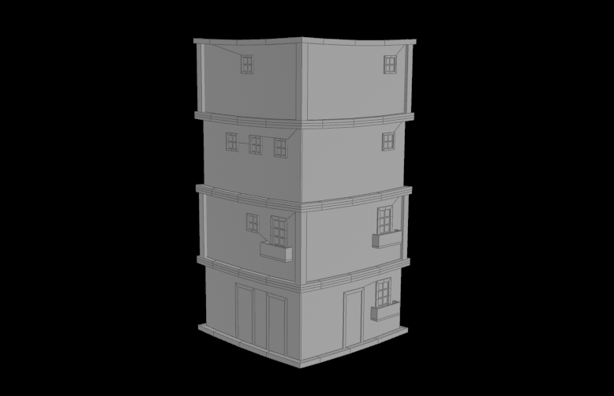
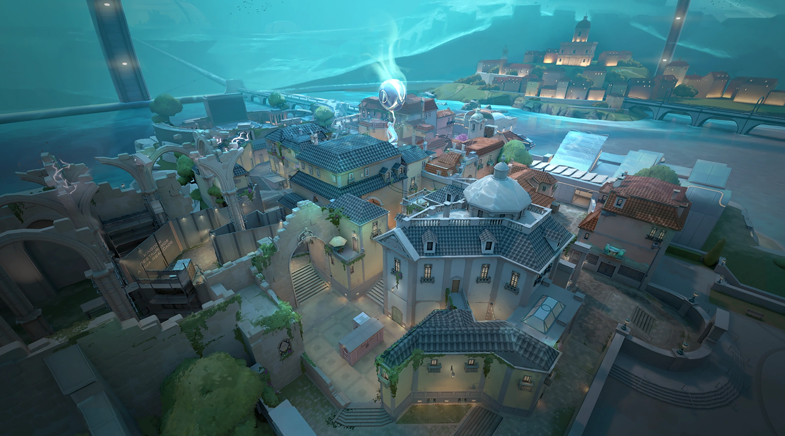
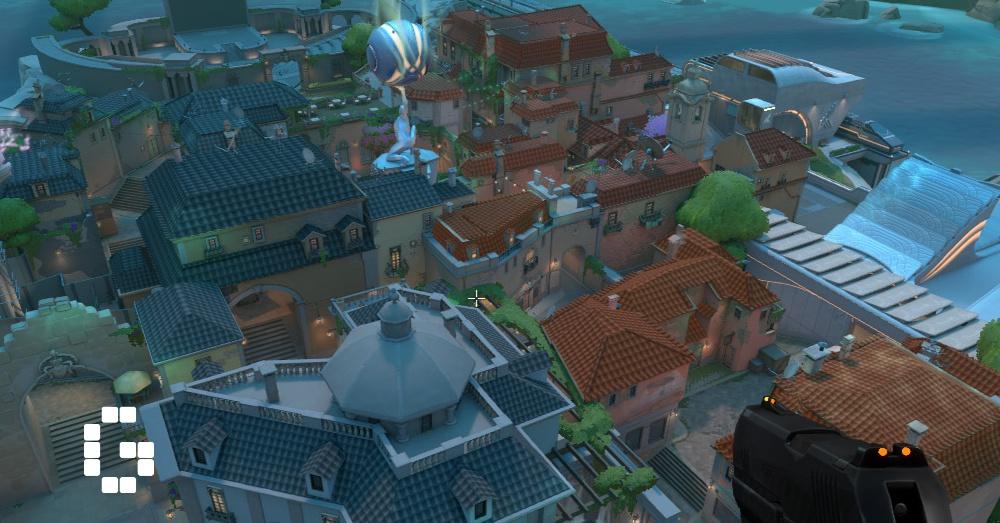
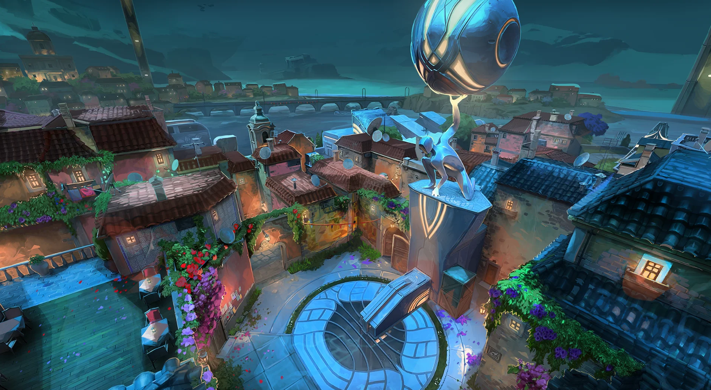
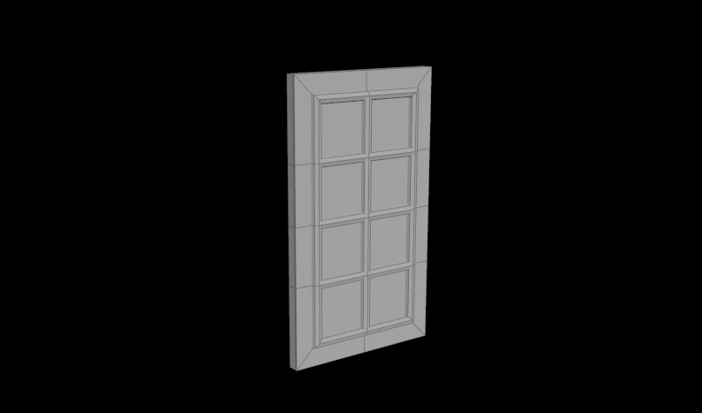
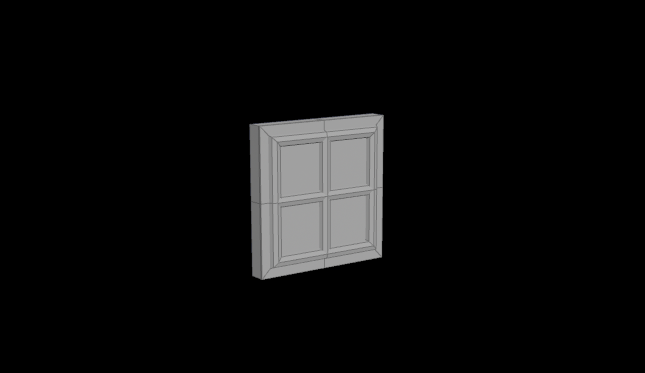
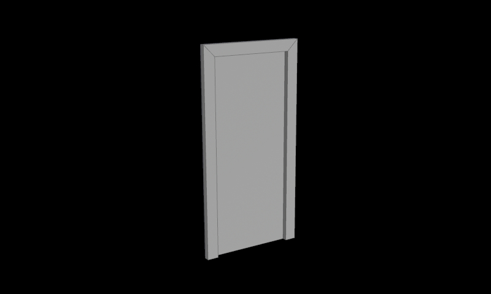
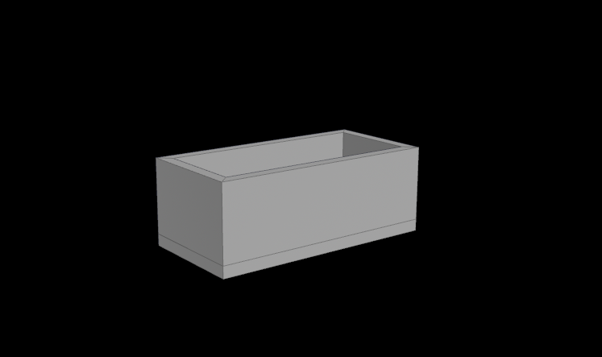

# CIS 5660 HW04 Procedural Buildings
## Procedural Building

https://github.com/user-attachments/assets/937fb192-1d72-4533-bb4f-0d726ee8e55b

## Setup and Planning 
### References
I was inspired by the buildings in Valorant's map Pearl. 

### Main Architechural Features
The main architechural features of this building style includes:
* Angular base shapes
* Rectangular windows with juliet balconies
* Pillars and borders
* Tiled roofs with dormer windows

### Main Assets Needed
The main assets I will need includes:
* Windows
* Balconies
* Roof Tiles
* Doors

## Assets Created in Houdini

### Procedural Windows

### Door

### Balcony

